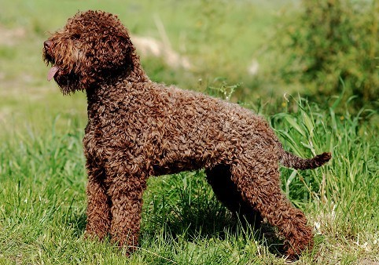
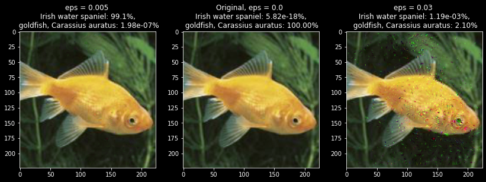

# loading_model.ipynb

In this [notebook](./loading_model.ipynb), I load a pretrained classification model from PyTorch and explore passing in some difficult images. I design some noise that tricks the model into making the wrong classification, with the input image looking unaltered.

Here's a sneak peak of how the image classification model can be tricked:

The left image is classified as an Irish Water spaniel, the middle is classified as a goldfish, and the right is neither. The results of the two left images should worry you! In the last section I go over how I made these images.

